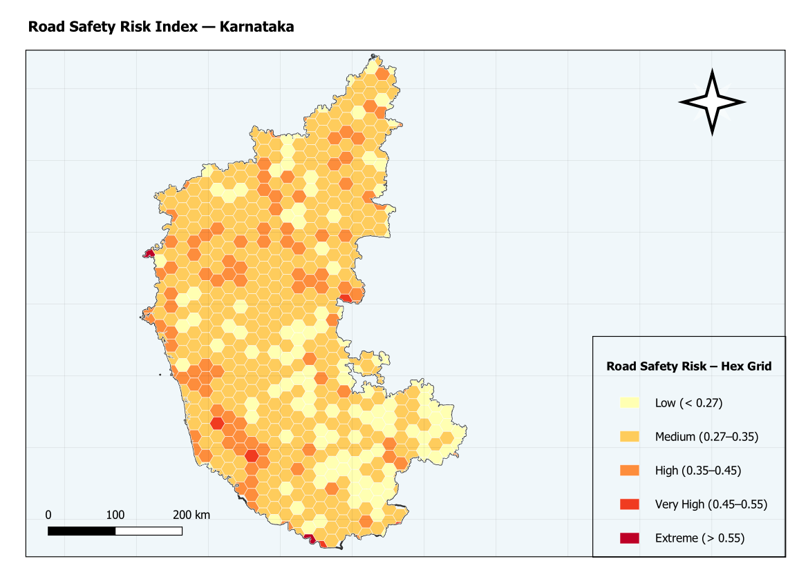

# Road Safety Risk Index — Karnataka

## Overview
This analysis builds a per-segment road safety risk score for Karnataka's major
road network using three OSM-derived risk factors: speed (actual or imputed),
road functional class, and infrastructure hazard (bridge/tunnel presence).
Scores are aggregated onto a 20 km hexagonal grid to produce a statewide risk
surface.

---

## Input Layers

  Layer                  Type   Features  CRS         Fields Used
  ---------------------  -----  --------  ----------  ---------------------------------
  karnataka              Poly   1         EPSG:4326   geometry (clip boundary)
  karnataka_major_roads  Line   42,475    EPSG:4326   fclass, maxspeed, bridge, tunnel

Reprojected to EPSG:32643 (WGS 84 / UTM Zone 43N) before all processing.

---

## Risk Scoring Model

### Component 1 — Speed Score (weight: 40%)
Actual maxspeed used where recorded (1,968 segments, 4.6% of total).
For the remaining 95.4% with maxspeed = 0 or NULL, speed was imputed by fclass:

  fclass              Imputed speed (km/h)
  ------------------  --------------------
  motorway            100
  motorway_link       80
  trunk               80
  trunk_link          60
  primary             60
  primary_link        50
  secondary           50
  secondary_link      40
  tertiary            40
  tertiary_link       30

  SPD_SCORE = speed_used / 100.0

### Component 2 — Road Class Score (weight: 35%)
Road functional class mapped to a 1–5 ordinal risk weight:

  fclass              Class weight
  ------------------  ------------
  motorway            5
  motorway_link       4
  trunk               4
  trunk_link          3
  primary             3
  primary_link        2
  secondary           2
  secondary_link      2
  tertiary            1
  tertiary_link       1

  CLS_SCORE = class_weight / 5.0

### Component 3 — Infrastructure Hazard Score (weight: 25%)
Bridge and tunnel segments present additional crash risk from
restricted geometry and driver behaviour changes:

  Condition           INFRA_SCORE
  ------------------  -----------
  tunnel = T          1.0
  bridge = T          0.6
  neither             0.0

Tunnels score higher than bridges given limited visibility and
reduced escape options.

### Composite Score
  RISK_SCORE = 0.40 × SPD_SCORE + 0.35 × CLS_SCORE + 0.25 × INFRA_SCORE

  Range: 0.0 (theoretical minimum) — 1.0 (theoretical maximum)
  Observed: Min=0.11  Median=0.23  Max=0.92

### Segment Classification (RISK_CLS)
  Class      Threshold       Count   Share
  ---------  --------------  ------  -----
  Very High  >= 0.55         4,014    9.5%
  High       0.35 – 0.549    6,693   15.8%
  Medium     0.20 – 0.349   30,973   72.9%
  Low        < 0.20            795    1.9%

---

## Hex Grid Aggregation

A 20 km hexagonal grid was clipped to Karnataka (652 cells). Mean and max
RISK_SCORE from intersecting segments were joined per cell using
native:joinbylocationsummary (intersects predicate).

### Hex Risk Zone Classification (on RISK_SCORE_mean)
  Zone       Threshold (mean)  Cells
  ---------  ----------------  -----
  Very High  >= 0.45           9
  High       0.35 – 0.449      104
  Medium     0.27 – 0.349      386
  Low        < 0.27            139
  No Data    no road coverage  14

---

## Output Files

  File                                 Description
  -----------------------------------  -----------------------------------------
  road_risk_segments.gpkg              All 42,475 segments with risk fields
  risk_hex_grid.gpkg                   652 hex cells with mean/max risk + RISK_ZONE
  Road_Safety_Risk_Index_Karnataka.qgz QGIS project with all layers + symbology
  README.md                            This file

### Computed Fields (road_risk_segments.gpkg)
  Field        Type    Description
  -----------  ------  ------------------------------------------------
  SPD_USED     Double  Speed used in scoring (actual or imputed, km/h)
  SPD_SCORE    Double  Normalized speed score (0–1)
  CLS_SCORE    Double  Normalized class risk score (0–1)
  INFRA_SCORE  Double  Infrastructure hazard score (0, 0.6, or 1.0)
  RISK_SCORE   Double  Composite weighted risk score (0–1)
  RISK_CLS     String  Very High / High / Medium / Low

---

## Symbology

  Layer                    Style
  -----------------------  ------------------------------------------------
  Road Risk Segments       Categorized on RISK_CLS: Dark Red > Red > Orange > Tan
  Risk Hex Grid            Graduated on RISK_SCORE_mean: YlOrRd 5-class ramp

---

## Key Findings
- 25.3% of segments (10,707) are classified High or Very High risk.
- Only 9 hex cells reach Very High mean risk, concentrated along
  motorway/trunk corridors and tunnel-dense terrain (Western Ghats).
- 72.9% of the network is Medium risk — predominantly tertiary roads
  at imputed 40 km/h with no bridge/tunnel involvement.

---

## Limitations
- 95.4% of segments rely on imputed speed from fclass. Actual posted
  speeds may differ, particularly on tertiary roads in urban areas.
- Risk score does not incorporate traffic volume, accident history,
  or pedestrian/cyclist exposure — all strong real-world risk factors.
- Bridge/tunnel flags from OSM may be incomplete in rural areas.
- Hex aggregation uses mean score per cell; a single high-risk motorway
  passing through a cell can be diluted by many low-risk tertiary roads.

---
Analysis date : May 2026
CRS           : EPSG:32643 (WGS 84 / UTM Zone 43N)
Data source   : OpenStreetMap via Karnataka GIS dataset

---

## Map Preview

